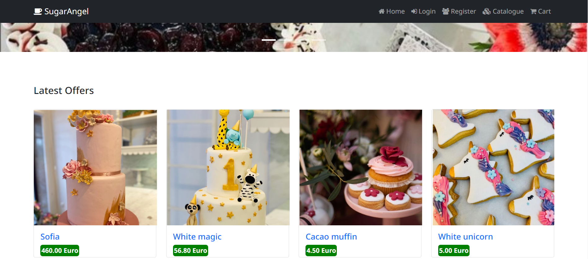
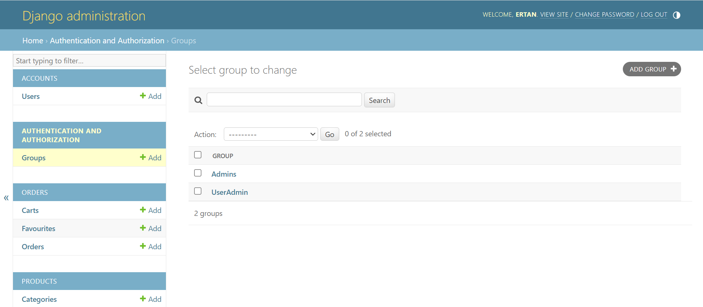

# E-Commerce Website: SugarAngel Coffee Workshop 

---- final project for Python Web Framework - SoftUni ----

## <ins>Build with:<ins>
- Python
- Django
- PostgreSQL
- HTML
- Django template language
- CSS
- JavaScript

## <ins>Description:</ins>

This project deals with developing a Virtual website ‘E-commerce Website’. It provides the user with a list of the various products available for purchase in the coffee shop.

## <ins>Paths:</ins>
  
1. <b>Home Page (/)</b>:
    - 
Landing page of the website.

      

2. <b>Admin Section (admin/):</b>
   #### Configured admin section with the following two groups:
   - Admins: Full control over the system. 
   - UserAdmin: CRUD operations for orders and products. Can review users.
     

      
